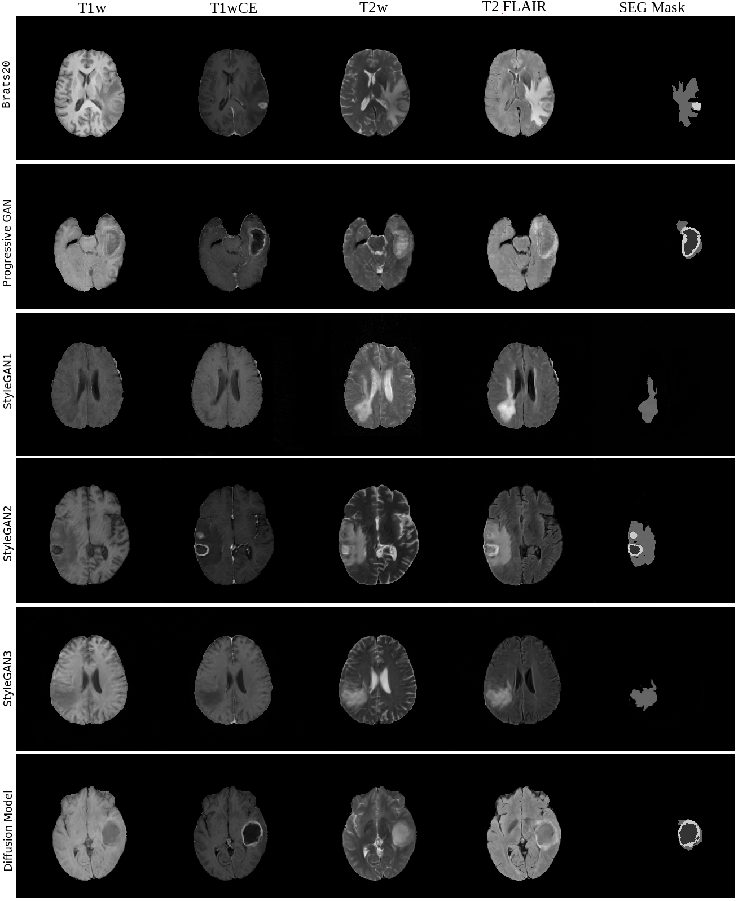

This repository includes Generative models for medical imaging, primarily focused on Brain MRI

Training several of the generative models was performed using the supercomputing resource Berzelius (752 Nvidia A100 GPUs) provided by the National Supercomputer Centre at Linköping University, Sweden. It was donated by the Knut and Alice Wallenberg Foundation. 

This research was supported by the ITEA/VINNOVA project ASSIST (Automation, Surgery Support and Intuitive 3D visualization to optimize workflow in IGT SysTems, 2021-01954), LiU Cancer and the Åke Wiberg foundation. Anders Eklund has previously received graphics hardware from Nvidia.

Some sample Synthetic images can be seen below 

## Citation

If you use this code in your research, please consider citing our work. You can find the relevant details in our paper at [https://ui.adsabs.harvard.edu/abs/2023arXiv230602986U/abstract].

You can use the following BibTeX entry for citation:

@article{ 
  akbar2023brain, 
  title={Brain tumor segmentation using synthetic MR images--A comparison of GANs and diffusion models}, 
  author={Akbar, Muhammad Usman and Larsson, Mans and Eklund, Anders}, 
  journal={arXiv preprint arXiv:2306.02986}, 
  year={2023} 

}

